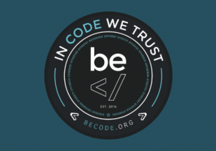

# Progressive-enhancement

## Résumé du travail
Ceci est un sprint html et css. dans ce parcour des excercises sont present tous au long des different point.

**Lien vert le cour** :arrow_right: [ici](https://github.com/becodeorg/CRL-Woods-3.21/blob/master/LearningPath/01-Prairie/05.HTML-CSS/progressive-enhancement/readme.md)

## Tables des matière
* 1.HTML : La sémantique 
    * 1.1 SEO
    * 1.2 Accesibilité
    * 1.3 Retranscription d'un texte avec les balises adéquate
* 2.CSS : Controler le rendu visuel
    * 2.1 Sélecteurs CSS
    * 2.2 Le bloc 
    * 2.3 Excercise
    * 2.4 Positionnement en CSS
* 3.Web fonts 
* 4.Outils utiles 
* 5.Excercises de fin

## 1)Sémentique
La sémentique en code html c'est utiliser les bonnes balise pour chaque bouts texte.
Exemple se demander qu'est ce que ce bout de texte ?
Les balises HTML 
 et  n'approte pas de sémentique.

## 1.1)SEO qu'est ce que c'est ?
**SEO (Search Engine Optimization)** signifie en français : **« Optimisation pour les moteurs de recherche »**.

Ce terme défini l’ensemble des **techniques** mises en œuvre pour **améliorer** la **position d’un site web** sur les pages de **résultats des moteurs** de recherche.
C'est a dire que le moteur de recherche trouve les page web grace a leur balisage etc.

## 1.2)Accesibilité
faire attention a l'accesibilité (aveugles et mal voyants).
-Si la sémentique est respecter alors un screen readers (lecture pour les aveugles) pourra lire a haute voix le site et ce serra compréhensible.

## 1.3)Retranscription d'un texte en HTML (exercises)
voir cour et fichier retranscription.html

